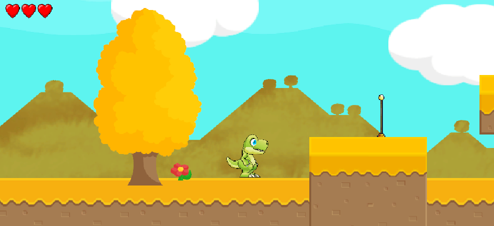
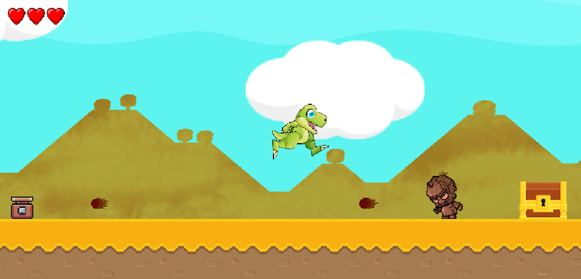

# Little Dino Quest

**Little Dino Quest** es una demo de plataformas 2D creada en Unity como proyecto de aprendizaje. El jugador controla a un pequeno dinosaurio que debe avanzar por habitaciones con plataformas, trampas, enemigos, cofres, monedas, checkpoints y dialogos.

El proyecto no es un juego comercial completo: es una plantilla jugable y ampliable que reune varias mecanicas basicas de un plataformas 2D.

## Capturas





## Gameplay

El objetivo principal es llegar al final del nivel sobreviviendo a los obstaculos. Durante la partida se pueden recoger monedas, abrir cofres, activar checkpoints, derrotar enemigos y avanzar por habitaciones que modifican el escenario mediante triggers.

Algunas partes del proyecto, como ciertos dialogos o recursos narrativos, estan preparadas para ampliarse. Si algun texto, escena o recurso no aparece completo en una build o en el repositorio, es porque el proyecto funciona como demo/plantilla y no todo el contenido narrativo final esta incluido.

## Controles

- **A / D**: moverse a izquierda y derecha.
- **W / S**: entrada vertical configurada para el movimiento 2D.
- **Espacio**: saltar.
- **Enter**: atacar/lanzar bola de fuego.
- **L**: avanzar el dialogo cuando hay una conversacion activa.
- **Esc**: pausar o reanudar la partida.

## Caracteristicas implementadas

- Menu principal, menu de pausa, menu de opciones e instrucciones.
- Movimiento 2D con salto, deteccion de suelo y deslizamiento en pared.
- Ataque del jugador mediante proyectiles reutilizados.
- Sistema de vida, dano, invulnerabilidad temporal, muerte y respawn.
- Checkpoints y pantalla de Game Over tras un limite de muertes.
- Cofres, monedas y contador de monedas.
- Pantalla de victoria con fade.
- Enemigos con patrulla, deteccion del jugador y ataques:
  - enemigo de patrulla,
  - enemigo cuerpo a cuerpo con kick,
  - enemigo cuerpo a cuerpo con slash,
  - enemigo a distancia con proyectiles.
- Trampas como pinchos, sierras, fire traps, spike head y trampas de flechas.
- Gestion de habitaciones con puertas, camara por salas y eventos por trigger.
- Sistema de dialogos cargado desde archivos de texto en `Resources/Textos`.
- Sistema de audio para musica, efectos, volumen de sonido y volumen de musica.

## Requisitos

- Unity **6000.3.6f1**.
- Universal Render Pipeline 2D.
- Input System de Unity.
- TextMesh Pro.

Las dependencias exactas estan definidas en:

```text
Simple 2D Game/Packages/manifest.json
```

## Como abrir el proyecto

1. Clona o descarga este repositorio.
2. Abre Unity Hub.
3. Selecciona **Add project from disk**.
4. Abre la carpeta:

```text
Simple 2D Game
```

5. Usa Unity **6000.3.6f1** o una version compatible.
6. Abre la escena `Assets/Levels/MainMenu.unity` para empezar desde el menu principal, o `Assets/Levels/Level 1.unity` para probar directamente el nivel.

## Estructura del proyecto

```text
Simple 2D Game/
+-- Assets/
|   +-- Animations/       # Animaciones del jugador, enemigos, cofres, trampas y proyectiles
|   +-- Audio/            # Musica y efectos de sonido
|   +-- Fonts/            # Fuentes usadas por la interfaz y dialogos
|   +-- Input/            # Acciones del Input System
|   +-- Levels/           # MainMenu y Level 1
|   +-- Prehabs/          # Prefabs del jugador, enemigos, trampas, proyectiles y coleccionables
|   +-- Resources/Textos/ # Textos y dialogos cargados en tiempo de ejecucion
|   +-- Scripts/          # Logica principal del juego
|   +-- Settings/         # Configuracion URP/2D
|   +-- Sprites/          # Sprites y paquetes graficos 2D
+-- Packages/
+-- ProjectSettings/
```

> Nota: la carpeta `Prehabs` mantiene el nombre usado actualmente en el proyecto.

## Scripts principales

- `PlayerMovement.cs`: movimiento, salto, deteccion de suelo/pared y bloqueo de input.
- `PlayerAttack.cs` y `Projectile.cs`: ataque del jugador y proyectiles.
- `Health.cs`, `Healthbar.cs`, `HealthCollectible.cs` y `PlayerRespawn.cs`: vida, dano, curacion, checkpoints y respawn.
- `Enemy.cs`, `PatrolEnemy.cs`, `KickEnemy.cs`, `SlashEnemy.cs` y `RangeEnemy.cs`: comportamiento base de enemigos, patrulla y ataques.
- `Firetrap.cs`, `ArrowTrap.cs`, `Spikehead.cs` y scripts relacionados: trampas y dano ambiental.
- `GameManager.cs`: monedas, dialogos, pausa, bloqueo de input y eventos de habitaciones.
- `UIManager.cs`: menus, instrucciones, Game Over, pausa, opciones y victoria.
- `Dialogue.cs`, `DialogueTrigger.cs` y `UITextFileLoader.cs`: sistema de dialogos desde archivos `.txt`.
- `Room.cs`, `Door.cs`, `ActivateTrigger.cs` y `CameraController.cs`: gestion de habitaciones, puertas, triggers y camara.

## Estado actual

El proyecto incluye:

- una escena de menu principal;
- un primer nivel jugable;
- jugador, enemigos, trampas, checkpoints, cofres y coleccionables;
- sistemas de UI, audio y dialogos;
- recursos preparados para seguir ampliando el contenido.

Pendiente o ampliable:

- mas niveles;
- mas dialogos y variantes narrativas;
- balance de dificultad;
- pulido visual/sonoro final;
- build final distribuible.

## Assets y recursos usados

Este proyecto utiliza recursos gratuitos y de terceros con fines educativos. Entre los assets graficos identificables dentro del proyecto estan:

- Dino character sprites: https://www.gameart2d.com/free-dino-sprites.html
- Pixel Adventure 1: https://assetstore.unity.com/packages/2d/characters/pixel-adventure-1-155360
- Free Platform Game Assets: https://assetstore.unity.com/packages/2d/environments/free-platform-game-assets-85838

Los recursos pertenecen a sus respectivos autores. Antes de redistribuir una build publica, conviene revisar la licencia de cada paquete grafico, fuente y archivo de audio incluido.

## Asistencia con IA

Algunos elementos menores, como el titulo del juego y mejoras de redaccion, recibieron ayuda de herramientas de IA. La implementacion de la logica, la estructura del proyecto y las mecanicas se desarrollaron manualmente como parte del proceso de aprendizaje.
